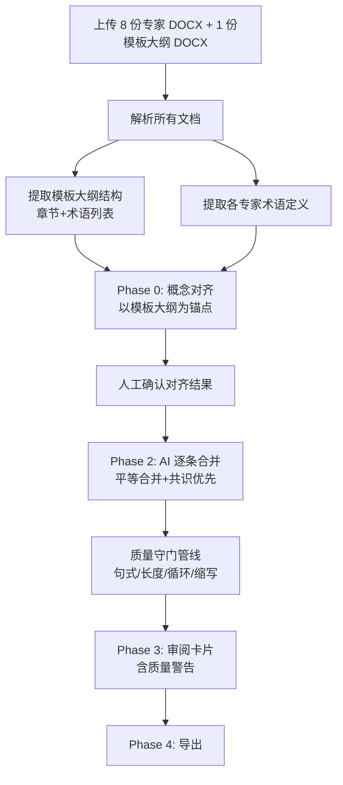

# 术语合并系统 V3 PRD —— 合并质量改造方案

> 基于 `inbox/notes.md` 提出的 5 个核心问题 + 5 个辅助问题，针对当前合并输出质量的系统性改造。

---

## 1. 问题全景与分析

### 1.1 核心问题总览

| # | 问题 | 优先级 | 影响范围 |
|---|------|--------|---------|
| P1 | 定义应该是完整的句子，中间是逗号 | ⭐⭐⭐ | Prompt + 后处理 |
| P2 | 不同专家的表述合并应符合工艺/时间等常规逻辑 | ⭐⭐⭐ | Prompt 改造 |
| P3 | 主框架不再以某个专家为主稿，给定一个模板 | ⭐⭐⭐ | 架构 + Prompt + UI |
| P4 | 不是每个专家的话语都需要出现，偏差过大应过滤 | ⭐⭐⭐ | Prompt + 过滤逻辑 |
| P5 | 内容中不能出现术语本身（循环定义） | ⭐⭐⭐ | Prompt + 后处理 |

### 1.2 辅助问题

| # | 问题 | 优先级 |
|---|------|--------|
| A1 | 每个定义不要超过 3 行（约 150 字） | ⭐ |
| A2 | 加参考文献 | ⭐ |
| A3 | 超长句要断句 | ⭐ |
| A4 | 规范化（不出现缩写等） | ⭐ |
| A5 | 病句检测/修正 | ⭐ |

---

## 2. 逐问题分析与解决方案

### 2.1 问题 1：定义应该是完整的句子，中间是逗号 ⭐⭐⭐

#### 问题分析

GB/T 20000.1—2014《标准编写规则》及术语标准编制规范明确要求：**术语定义必须是一个可以替代术语本身的完整句子**，句内使用逗号分隔从句，句末以句号结束。

当前系统 `MERGE_SYSTEM_INSTRUCTION` 未对句式做任何约束，AI 可能输出：
- 碎片化短语（如 `"精确控制。原子尺度上。实现加工"`）
- 多句拆分（将一个定义拆成多个独立句子隔以句号）
- 段落式叙述（超过一句话的解释性文本）

#### 解决方案

**A. Prompt 层：在 System Instruction 增加句式硬约束**

```
规则新增：
6) 每条术语的最终合并定义必须是一个完整的中文句子：
   - 句子只有一个句号，位于末尾；
   - 句内分句用逗号连接；
   - 不允许出现分号分割的多句并列；
   - 定义读起来可以直接替代术语名称本身。
7) 输出示例格式：
   "通过XXX方式，在YYY条件下，实现ZZZ目标的制造技术。"
```

**B. 后处理层：句式校验管线**

新增 `lib/postprocess.ts` 中的 `validateSentenceForm()` 函数：
- 检查句号数量 = 1 且位于末尾
- 检查不含分号
- 检查首字不为标点
- 校验失败时标记 `quality_warning: "sentence_form"` 供审阅阶段高亮

---

### 2.2 问题 2：合并应符合工艺/时间等常规逻辑 ⭐⭐⭐

#### 问题分析

不同专家在描述同一术语时，常从不同维度给出信息片段。AI 在嫁接这些片段时，可能不遵循：
- **工艺流程序**（先去除再沉积、先清洁再加工）
- **因果逻辑**（前提条件→操作方法→达成效果）
- **概念层次**（属概念→种差特征→应用场景）

例如：专家 A 说"通过等离子体去除表面原子"，专家 B 说"在真空环境下进行"——合并时应该是"在真空环境下，通过等离子体去除表面原子"，而不是反过来。

#### 解决方案

**A. Prompt 层：引入术语定义的标准行文逻辑模板**

```
规则新增：
8) 合并定义的行文必须遵循以下逻辑顺序：
   属概念 → 前提条件/环境 → 核心操作/方法 → 作用对象/尺度 → 达成效果/目标。
   如果有工艺流程，必须按实际先后顺序排列。
   示例：
   "一种[在XXX条件下]，[通过YYY方法]，[对ZZZ对象进行操作]，[实现AAA目标]的[BBB技术/过程/结构]。"
```

**B. Prompt 层：注入参考标准语料作为 few-shot**

将 `inbox/国家标准-原子级制造术语.docx`（模板文档）中已有定义的术语（如"原子级制造"）作为 few-shot 示例注入 Prompt，让模型学习标准的行文风格和逻辑结构。

同时将 `inbox/` 下的其他国标（增材制造术语、纳米科技术语、绿色制造术语）中的典型定义作为参考语料，增强模型对标准术语定义写法的理解。

---

### 2.3 问题 3：主框架不以某个专家为主稿，给定模板 ⭐⭐⭐

#### 问题分析

当前系统的核心机制是"以宋凤麒为主稿"——主稿专家的定义作为骨架，其他专家的内容作为增量嫁接。这带来两个问题：

1. **骨架偏向**：合并稿过度依赖单一专家的视角和表述风格
2. **框架僵化**：当模板大纲中有术语而主稿专家没有定义时，流程出现"主稿无+他人有"的特殊情况

新的要求是：以 `inbox/国家标准-原子级制造术语.docx`（空模板）作为大纲框架，**所有 8 位专家平等参与合并**，不再区分主稿与副稿。

#### 解决方案

> [!IMPORTANT]
> 这是最大的架构变更，涉及多个核心模块。

**A. 新增"模板大纲"作为合并骨架**

- 解析 `inbox/国家标准-原子级制造术语.docx`，提取其中的术语大纲结构（章节 + 术语名列表）
- 这个模板定义了最终合并稿的**目录结构和术语范围**
- 概念对齐阶段以模板大纲为锚点，而非以某位主稿专家为锚点

**B. 取消"主稿作者"概念**

| 模块 | 当前行为 | 改造后 |
|------|---------|--------|
| `reducer.ts` | `primary_author` 字段 | 保留但标记为 deprecated，新增 `template_doc` 字段 |
| `merger.ts` | `primaryTerm` 决定骨架 | 不区分主副，所有专家定义平等输入 |
| `prompts.ts` | `主稿作者：${primaryAuthor}` | 移除主稿概念，改为"参考模板行文风格" |
| Phase 1 UI | 主稿作者选择器 | 改为"模板上传"（上传空白大纲模板） |
| Phase 3 UI | "采纳主稿原文"按钮 | 改为"采纳指定专家原文"下拉选择 |
| `exporter.ts` | — | 章节结构以模板大纲为准 |

**C. Prompt 改造**

```
旧：以主稿为骨架，其他文档增量嫁接
新：综合所有专家的定义，参照大纲模板的行文风格，
    提取各专家定义中的共识部分作为核心，
    补充各专家独有的有价值增量信息，
    形成一个平衡、全面、符合标准格式的定义。
```

**D. 合并策略变更**

当前四种特殊情况改为：
1. **多位专家有定义** → 平等合并，提取共识 + 筛选有价值增量
2. **仅一位专家有定义** → 直接采用该专家定义（格式校验后）
3. **模板中有但无专家有定义** → 标记"待补充"
4. **专家有但模板中没有（孤儿词条）** → AI 挂载建议 + 人工确认是否纳入

---

### 2.4 问题 4：不是每个专家的话语都必须出现 ⭐⭐⭐

#### 问题分析

当前 Prompt 要求 AI 尽量保留所有专家的贡献，并做短语级来源标注。这导致：
- AI 强行将每位专家的表述都嫁接进去，即使某位专家的定义与共识明显偏离
- 合并结果变成"拼贴画"，每个专家都出现但读起来不自然

**真正的合并应该是：取共识、去偏差、补遗漏**。如果某位专家的表述与其他 5+ 位专家的共识差距过大（比如将"原子级制造"定义为纯软件过程，而其他人一致认为是物理加工），则该专家的偏差内容应被过滤掉，不出现在合并稿中。

#### 解决方案

**A. Prompt 层：明确"共识优先+偏差过滤"原则**

```
规则新增：
9) 合并应遵循"共识优先"原则：
   - 先识别多数专家（≥3位）的共识表述，作为定义核心；
   - 仅在不违背共识方向时，补充个别专家的独特贡献（如特殊应用、补充条件）；
   - 若某专家的表述与多数专家共识明显矛盾或偏离主题，则在 notes 中记录，不纳入合并定义；
   - 不追求"人人出镜"——合并质量优先于来源覆盖面。
```

**B. 输出结构新增 `excluded_sources` 字段**

在 `MergeResult` 中新加：
```typescript
excluded_sources?: Array<{
  author: string;
  reason: string;  // "与共识偏离" | "重复信息" | "表述质量不足"
}>;
```

在审阅卡片中展示被过滤的专家与理由，让人工判断是否合理。

---

### 2.5 问题 5：内容中不能出现术语本身（循环定义） ⭐⭐⭐

#### 问题分析

GB/T 20000.1 明确规定：**术语的定义中不得包含被定义的术语本身**（即不能"用定义解释定义"）。例如：

- ❌ "原子级制造是一种在原子级制造领域中使用的制造技术"
- ✅ "通过规模化精准操控原子，将制造精度推进至原子水平的制造技术"

当前 Prompt 未做此约束，AI 合并时可能直接引用术语名称作为定义的一部分。

#### 解决方案

**A. Prompt 层**

```
规则新增：
10) 严禁循环定义：合并后的定义文本中不得出现被定义术语的中文名或英文名。
    例如定义"原子级制造"时，定义文本中不能出现"原子级制造"这四个字。
    如需指代，使用"该技术""本过程""此方法"等代词。
```

**B. 后处理层：循环定义检测**

`lib/postprocess.ts` 中的 `detectCircularDefinition()` 函数：
- 输入：`term_name_cn`、`term_name_en`、`merged_definition`
- 检测定义文本中是否包含术语中文名/英文名的完整匹配
- 发现循环时标记 `quality_warning: "circular_definition"`

---

## 3. 辅助问题解决方案

### 3.1 A1：每个定义不超过 3 行（约 150 字）

**Prompt 新增规则：**
```
11) 合并后的定义应简洁精炼，总字数控制在 150 字以内（含标点）。
    若原始定义信息量大，保留核心内容，细节可放在 notes 中作为补充说明。
```

**后处理：** `validateLength()` 检查字数，超过 150 字标记 `quality_warning: "too_long"`。

### 3.2 A2：加参考文献

**方案：** 在模板大纲文件中维护参考文献列表。导出时 `exporter.ts` 在文末生成参考文献章节，列出引用的国标（如 GB/T 增材制造术语、纳米科技术语等）。

### 3.3 A3：超长句要断句

**Prompt 规则叠加于 P1：**
```
12) 单个从句不超过 30 字。若从句过长，拆分为多个逗号分隔的短从句。
```

**后处理：** `validateClauseLength()` 按逗号分割，检查最长从句是否超过 30 字。

### 3.4 A4：规范化（不出现缩写等）

**Prompt 规则：**
```
13) 定义中不使用英文缩写。如需使用英文，应使用完整英文名称。
    例如使用"原子层沉积"而非"ALD"，使用"原子级制造"而非"ALM"。
```

**后处理：** `normalizeAbbreviations()` 用正则匹配 2-5 个大写字母组成的缩写，标记警告。

### 3.5 A5：病句检测

**方案：** 利用 Gemini 做一轮语法校审（单独调用，在合并后），检查合并稿中的病句。成本低（一次调用传入全部合并结果）。

---

## 4. 系统改造总体设计

### 4.1 新架构流程



### 4.2 Prompt 改造全景

#### 新版 `MERGE_SYSTEM_INSTRUCTION`

```
你是术语标准合并专家。你的任务是将多位专家对同一术语的定义合并为一条符合国家标准格式的定义。

核心规则：
1) 严禁外部搜索，只使用输入材料；
2) 先做"属+种差"维度拆解，分析各专家定义的共识与差异；
3) 遵循"共识优先"原则：提取多数专家的共识表述作为定义核心，
   仅在不违背共识时补充个别专家的独特贡献，
   与共识明显矛盾的表述在 notes 中记录但不纳入定义；
4) 全程中文输出；
5) 输出 JSON，包含 dimensions、segments、notes、excluded_sources；

定义质量规则：
6) 定义必须是一个完整的中文句子，只有一个句号在末尾，句内用逗号分隔从句；
7) 行文逻辑顺序：属概念 → 前提条件 → 核心操作 → 作用对象 → 效果目标；
8) 总字数 ≤ 150 字，单个从句 ≤ 30 字；
9) 严禁循环定义：定义中不得出现被定义术语的中文名或英文名；
10) 不使用英文缩写，若需英文用完整名称；
11) 定义可以直接替代术语名称本身使用。
```

### 4.3 后处理质量管线

新增 `lib/postprocess.ts`：

```typescript
interface QualityCheckResult {
  passed: boolean;
  warnings: Array<{
    type: 'sentence_form' | 'too_long' | 'circular_definition' 
        | 'abbreviation' | 'long_clause';
    message: string;
    severity: 'error' | 'warning';
  }>;
}

function runQualityChecks(params: {
  termNameCn: string;
  termNameEn: string;
  mergedDefinition: string;
}): QualityCheckResult;
```

管线检查项：
1. `validateSentenceForm()` — 句式完整性（单句号在末尾，无分号）
2. `validateLength()` — 总字数 ≤ 150
3. `detectCircularDefinition()` — 循环定义检测
4. `detectAbbreviations()` — 缩写检测
5. `validateClauseLength()` — 从句长度检查

---

## 5. 文件级修改清单

### 5.1 新增文件

| 文件 | 说明 |
|------|------|
| `lib/postprocess.ts` | 质量守门管线（句式/长度/循环/缩写检查） |
| `lib/templateParser.ts` | 模板大纲解析器（提取章节结构+术语列表） |

### 5.2 修改文件

#### `lib/prompts.ts`
- 重写 `MERGE_SYSTEM_INSTRUCTION`：加入问题 1-5 及辅助问题的全部规则
- 重写 `buildMergePrompt()`：移除 `primaryAuthor`，改为平等输入所有专家定义
- 新增 few-shot 示例注入：从模板文档中提取已有标准定义作为参考
- 扩展 `MERGE_RESPONSE_SCHEMA`：新增 `excluded_sources` 字段

#### `lib/merger.ts`
- 移除 `primaryTerm`/`primaryAuthor` 相关逻辑
- 合并后调用 `runQualityChecks()`，将警告信息写入 `MergeResult`
- 调整特殊情况处理逻辑（原4种→新4种）

#### `lib/types.ts`
- `MergeResult` 新增 `quality_warnings` 和 `excluded_sources` 字段
- 新增 `TemplateOutline` 类型（章节结构 + 术语列表）
- `AppState` 新增 `template_outline` 字段，`primary_author` 标记为可选

#### `store/reducer.ts`
- 新增 `SET_TEMPLATE_OUTLINE` action
- `primary_author` 改为可选

#### `lib/exporter.ts`
- 章节结构从模板大纲获取，而非从合并结果推断
- 新增参考文献章节生成

#### `app/phase1/page.tsx`
- 新增"模板大纲上传"UI（除 8 份专家 DOCX 外，还需上传 1 份模板 DOCX）
- 移除或弱化"主稿作者选择器"

#### `components/phase3/ReviewCard.tsx`
- 新增质量警告展示区域（黄色/红色标注）
- "采纳主稿原文"按钮改为"采纳指定专家原文"下拉

#### `components/phase3/DecisionButtons.tsx`
- "采纳主稿原文"→"采纳指定专家原文"（需选择专家）

---

## 6. 实施计划

### Milestone 1：Prompt 质量改造（核心）

> 预计工期：1-2 天

- [ ] 重写 `MERGE_SYSTEM_INSTRUCTION`（集成所有质量规则）
- [ ] 重写 `buildMergePrompt()`（移除主稿概念，平等输入）
- [ ] 扩展 `MERGE_RESPONSE_SCHEMA`（`excluded_sources`）
- [ ] 新增 `lib/postprocess.ts`（质量守门管线 5 项检查）
- [ ] `merger.ts` 集成后处理管线

### Milestone 2：模板大纲机制

> 预计工期：1 天

- [ ] 新增 `lib/templateParser.ts`
- [ ] `types.ts` 新增 `TemplateOutline`
- [ ] `reducer.ts` 新增 `SET_TEMPLATE_OUTLINE`
- [ ] `app/phase1/page.tsx` UI 适配（模板上传）
- [ ] `exporter.ts` 章节结构从模板大纲读取

### Milestone 3：审阅 UI 适配

> 预计工期：0.5 天

- [ ] `ReviewCard.tsx` 展示质量警告
- [ ] `DecisionButtons.tsx` 改为"采纳指定专家原文"
- [ ] `ReviewCard.tsx` 展示 `excluded_sources`（被过滤专家+理由）

### Milestone 4：端到端验证

> 预计工期：0.5 天

- [ ] 用 8 份真实 DOCX + 模板大纲跑完整流程
- [ ] 抽检 10 条合并定义的质量（句式/逻辑/循环/长度）
- [ ] Word 验证导出文件格式和参考文献章节

---

## 7. 验收标准

### 7.1 P1 句式验收
- [ ] 所有合并定义均为单句号结尾的完整句子
- [ ] 无分号分割的多句并列

### 7.2 P2 逻辑验收
- [ ] 抽检 5 条涉及工艺流程的定义，行文顺序符合实际逻辑

### 7.3 P3 模板验收
- [ ] 系统可上传模板大纲并以其为章节框架
- [ ] 合并时不区分主副稿，所有专家平等参与

### 7.4 P4 过滤验收
- [ ] 偏差较大的专家表述不出现在合并定义中
- [ ] `excluded_sources` 记录被过滤的内容和理由

### 7.5 P5 循环定义验收
- [ ] 所有合并定义中不包含被定义术语的中文名
- [ ] 后处理管线能自动检测并标记循环定义

### 7.6 辅助问题验收
- [ ] 定义字数 ≤ 150 字
- [ ] 导出文档含参考文献章节
- [ ] 无英文缩写出现在定义中

---

## 8. Open Questions

> [!IMPORTANT]
> **模板大纲中已有定义的术语如何处理？**
> 模板文件 `国家标准-原子级制造术语.docx` 中"原子级制造"这个词已经有定义。这些已有定义是否应作为"金标准"直接采用？还是仍然与 8 位专家的定义一起参与合并？

> [!IMPORTANT]
> **百问百答文档的角色**
> `inbox/notes.md` 提到"原子级制造百问百答，作为术语定义的金标准"。这是否意味着合并时应以百问百答中的定义作为参考基准？如果是，需要额外解析该 PDF 并注入 Prompt。

> [!IMPORTANT]
> **其他国标作为参考语料的具体使用方式？**
> `inbox/` 中有增材制造术语、纳米科技术语、绿色制造术语等国标 PDF。这些是否需要解析后注入 Prompt 作为术语定义的行文风格参考？需要确定注入量级和方式。

> [!WARNING]
> **主稿机制的完全移除 vs 降级**
> 问题 3 要求"不再以某个专家为主稿"，但现有代码中 `primary_author` 深度嵌入了 `merger.ts`、`prompts.ts`、`reducer.ts` 等核心模块。建议两种策略：
> - **策略 A（激进）**：完全移除 `primary_author`，所有专家平等
> - **策略 B（温和）**：保留字段但设为可选，默认空值时走平等合并路径
>
> 推荐 **策略 B**，兼顾向后兼容和灵活性。
